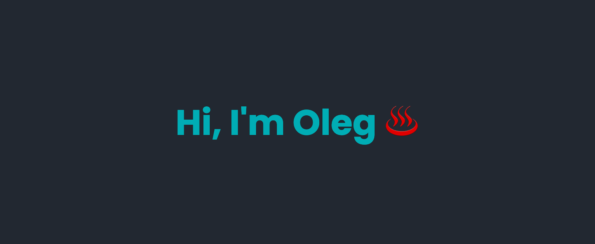

# 👋 About me
Working with almost everything related to programming:
* 🥇 Gold medal at GENIUS Olympiad in robotics category that took place in New York
* 📚 Created website for managing and simplifying student life
* 🏫 Active member of IT Student Council at Igor Sikorsky Kyiv Polytechnic Institute
* 🔍 Algorithms and structures research at University
* 👨‍💻 Earned prize-winning positions in city and regional competitive programming contests

# 💻 Tech stack
### Frontend

### Backend

### Other tools

# 🌐 Socials

